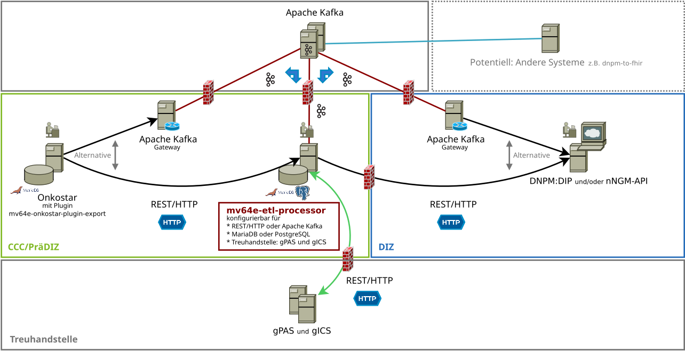

# ETL-Prozessor für das Modellvorhaben Genomsequenzierung gem. §64e SGB V

ETL-Anwendung zur Pseudonymisierung von klinischen Daten für das Modellvorhaben Genomsequenzierung gem. §64e SGB V
im DNPM-Datenmodell 2.1 unter Beachtung und Verwendung der Teilnahmeerklärung und des Broad-Consents.

Pseudonymisierte und mit Consent versehene Datensätze können sowohl an DNPM:DIP als auch an nNGM weitergeleitet werden.
Eine Differenzierung anhand der Erkrankung und ICD10-Code ist dabei möglich.
So können zum Beispiel alle Lungenfälle an nNGM, sonstige Fällen an DNPM:DIP ausgeleitet werden.

Zur Pseudonymgenerierung und Consentverwaltung werden
die [Greifswalder Tools gPAS und gICS](https://www.ths-greifswald.de/)
unterstützt.

Diese Anwendung erlaubt das Entgegennehmen von Datensetzen im DNPM-Datenmodell 2.1 aus
dem [Onkostar](https://www.it-choice.de/produkte/onkostar/)-Plugin
[mv64e-onkostar-plugin-export](https://github.com/pcvolkmer/mv64e-onkostar-plugin-export).

## Docker-Images

Docker-Images dieser Anwendung werden hier bereitgestellt und sollen das lokale Deployment vereinfachen:
https://github.com/pcvolkmer/mv64e-etl-processor/pkgs/container/mv64e-etl-processor

## Wichtige Änderungen

### 🔥 Wichtige Änderungen in Version 0.18

Ab Version 0.18 kann diese Anwendung zur Datenausleitung über die nNGM-REST-API verwendet werden.
Dazu kann auch die Konfiguration des in dieser Version eingeführten [Routing-Mechanismus](docs/configuration.md#routed-rest) verwendet
werden.

### Weitere Änderungen

Siehe [CHANGELOG.md](CHANGELOG.md)

## Wesentlichen Funktionen für das Modellvorhaben Genomsequenzierung

Diese Anwendung unterstützt die wesentlichen Funktionen für den Betrieb einer ETL-Strecke für das Modellvorhaben
Genomsequenzierung nach der Datenextraktion:

* Generierung von Vorgangsnummern
* Pseudonymisierung der Patienten-ID
* Einbetten von Consent-Informationen

Dies ist nach einem Export aus dem Primärsystem (z.B. Onkostar) in der Regel noch nicht erfolgt und kann mit dieser
Anwendung realisiert werden.

### Vorgangsummern

Jede Datenübertragung benötigt eine eindeutige Vorgangsnummer.
Diese Anwendung stellt die erforderlichen Schnittstellen bereit, um eine Vorgangsnummer zu generieren und in den
Datensatz
zu integrieren.

Weitere Informationen zur Konfiguration der Generierung von Vorgangsnummern gibt es hier:
[docs/configuration.md - Vorgangsnummern](docs/configuration.md#vorgangsnummern).

### Pseudonymisierung der Patienten-ID

Diese Anwendung nutzt die Pseudonymisierungsfunktion von gPAS. Wenn eine URI zu einer gPAS-Instanz (Version >= 2023.1.0)
angegeben ist, wird diese verwendet.
Ist diese nicht gesetzt, wird intern eine Anonymisierung der Patienten-ID vorgenommen.

Weitere Informationen zur Konfiguration der Pseudonymisierung gibt es hier:
[docs/configuration.md - Pseudonymisierung der Patienten-ID](docs/configuration.md#pseudonymisierung-der-patienten-id).

### Einbetten von Consent-Informationen

Einbettung von Consent-Informationen kann optional mithilfe von gICS geschehen.

Weitere Informationen zur Konfiguration der Integration und Einbettung von Consent-Informationen gibt es hier:
[docs/configuration.md - Teilnahmeerklärung und Broad Consent mit gICS](docs/configuration.md#teilnahmeerklärung-und-broad-consent-mit-gics).

## Weitere Funktionen

Neben den wesentlichen Funktionen unterstützt diese Anwendung zudem:

* Konfiguration der Datenein- und Ausgabe zur Unterstützung von REST-Schnittstellen und Message-oriented Middleware
  (MoM) mit Apache Kafka.
* Absicherung des Zugriffs durch Anmeldung und Authentifizierung – inklusive der Nutzung von OpenID-Connect.
* Ausleitung von Datensätzen sowohl an DNPM:DIP, als auch die nNGM-API für das Modellvorhaben Genomsequenzierung.
* Duplikaterkennung zum Verhindern von mehrmaliger Übertragung unveränderter Datensätze.
* Blockieren von weiteren Übertragungen ohne bestätigte, initiale Meldung mit Meldebestätigung.
* Automatische FollowUp-Erkennung (nach einer initialen Meldung).
* Eine einfache Weboberfläche zur Nachverfolgung von Datensätzen.

Alle Informationen zur Konfiguration dieser Funktionen gibt es hier:
[docs/configuration.md](docs/configuration.md).

## Entwicklungssetup

Informationen für ein Entwicklungssetup sind in [docs/development.md](docs/development.md) zu finden.
Dort sind auch Informationen zur Anpassung des Docker-Images zu hinterlegt.
